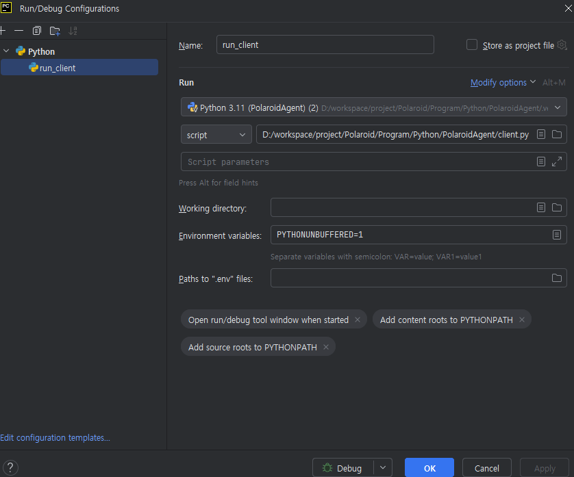

# PolaroidAgent
이 프로젝트는 폴라로이드 프린터와 통신하는 Client 용도로 사용됩니다.

## 특징
- Instax 프린터와 직접적으로 BLE 통신하는 주체입니다.
- 프린터와 Client는 1:1 관계입니다.
- Client가 관련된 키오스크와 통신합니다.
  - 소켓 통신 패킷 정의는 C#(키오스크)쪽 프로젝트와도 맞춰야합니다. 

## 시작하기
- Python 3.11 버전으로 Interpreter 추가합니다.(venv 설정)
- terminal에서 venv가 활성화된 상태인지 확인합니다.
  - 경로 앞에 `(.venv)` 라는 표시가 있는지 확인
- `pip install -r .\requirements.txt` command 입력 후 정상적으로 패키지 install이 됐는지 확인합니다.
- `settings.py`에서 환경변수를 개발 환경에 맞춰 설정해줍니다.
  - 이거는 Edit Configuration에서도 설정할 수 있음

## 실행하기
- 아래와 같이 Edit Configuration에서 client.py를 실행하도록 설정
- 